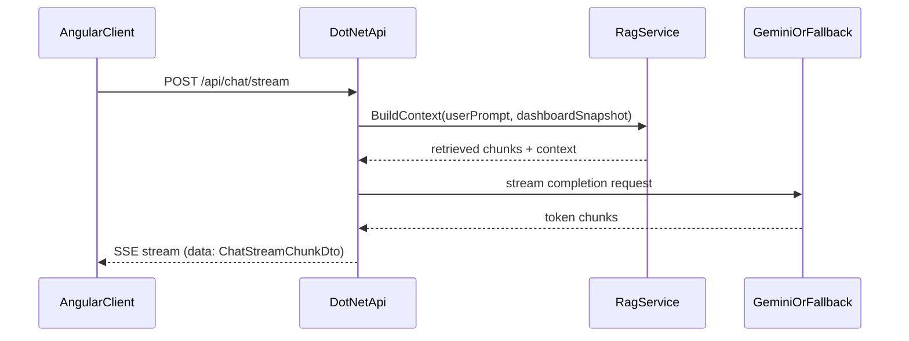

# Smart Angular Dashboard + .NET LLM Proxy

Portfolio project for Angular 21 + .NET 9 that demonstrates:
- streaming chat UX in Angular
- server-side LLM proxying (Gemini / Mock / Ollama)
- typed API contracts across frontend and backend
- basic RAG with lexical retrieval over local documents

## Architecture



## Tech stack

- Angular **21** (standalone, zoneless, signals)
- .NET **9** minimal API (`net9.0`)
- Gemini API (`streamGenerateContent`) as default provider
- Mock and Ollama providers for no-key / offline workflows

## Project layout

```text
/client                 Angular frontend
/server                 .NET 9 API
/server/Rag/Documents   RAG corpus for retrieval
/README.md
```

## Local run

1) Install dependencies:

```bash
npm --prefix client install
dotnet restore server/server.csproj
```

2) Configure provider:

- Default in development is `Mock` (`server/appsettings.Development.json`).
- For Gemini, set user secrets (recommended):

```bash
dotnet user-secrets init --project server/server.csproj
dotnet user-secrets set "Llm:Provider" "Gemini" --project server/server.csproj
dotnet user-secrets set "Llm:Gemini:ApiKey" "<YOUR_GEMINI_API_KEY>" --project server/server.csproj
dotnet user-secrets set "Llm:Gemini:ModelId" "gemini-2.0-flash" --project server/server.csproj
```

3) Start apps in separate terminals:

```bash
npm run dev:client
npm run dev:server
```

Frontend: `http://localhost:4200`  
Backend: `http://localhost:5137`

## Streaming protocol

`POST /api/chat/stream` returns `text/event-stream`.

Each SSE payload is JSON:

```json
{ "type": "chunk", "delta": "text..." }
```

Other chunk types:
- `meta` (provider metadata)
- `done` (stream completed)
- `error` (backend/provider failure)

## RAG implementation

- Corpus: markdown/txt files under `server/Rag/Documents`.
- Chunking: paragraph chunks.
- Retrieval: lexical scoring (term overlap) + top-k selection.
- Prompting: retrieved context is injected into system prompt and constrained to avoid unsupported claims.

## Deployment notes

### Angular
- Build: `npm run build:client`
- Host on Azure Static Web Apps, GitHub Pages, or Cloudflare Pages.

### .NET API
- Build: `npm run build:server`
- Deploy to Azure App Service, Railway, or Render.
- Configure env vars in host:
  - `LLM__Provider=Gemini`
  - `LLM__GEMINI__APIKEY=<secret>`
  - `LLM__GEMINI__MODELID=gemini-2.0-flash`
  - optional `LLM__OLLAMA__BASEURL=http://localhost:11434`

### Security
- Never expose provider keys in Angular.
- Never commit secrets to source control.
- Restrict CORS to known frontend origins in production.
